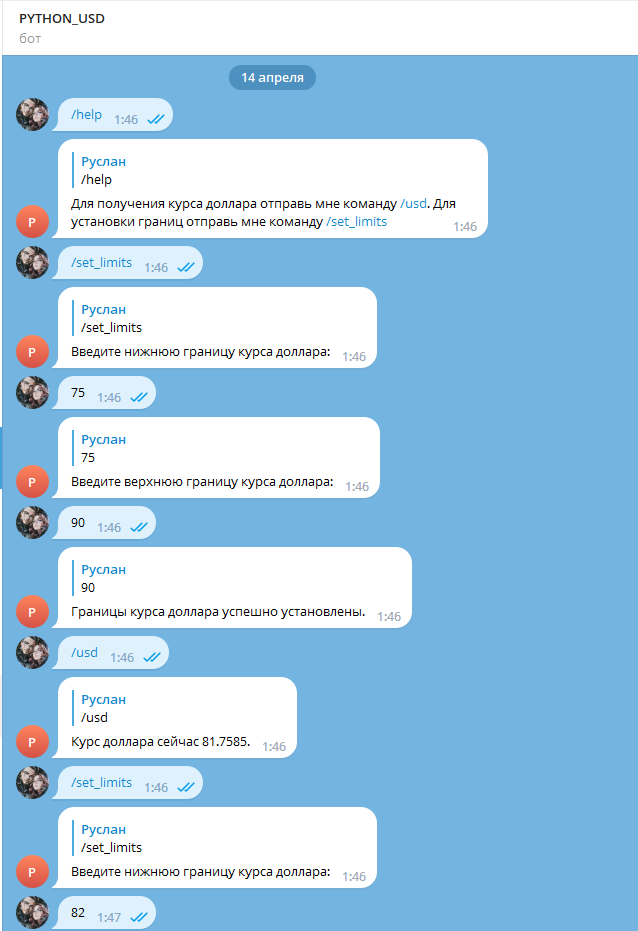

# Телеграмм-бот PYTHON-USD-PARSE
PYTHON-USD-PARSE - это телеграмм-бот, который позволяет получить текущий курс доллара если он выйдет за заданные границы (2 границы верхняя и нижняя)

# Использование
- Откройте чат с ботом по ссылке https://t.me/PYTHON_USD_BOT
- Введите команду /start, для начала работы с ботом
- Введите команду /help, для получение помощи пользования ботом
- Введите команду /usd, для получение текущего курса
- Чтобы изменить заданные границы - перейдите в файл ExchangeRate.py и измените две переменные "lower_limit", "upper_limit"

# Для работы бота нужно:
- Python 3.7 +
- Библиотеки:
- time
- telebot
- requests
# Пример работы с ботом
